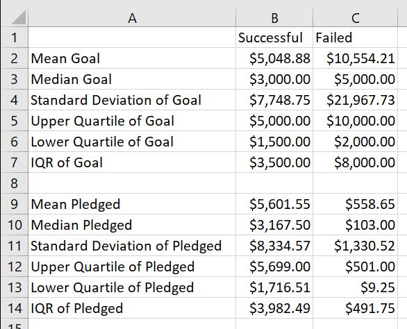
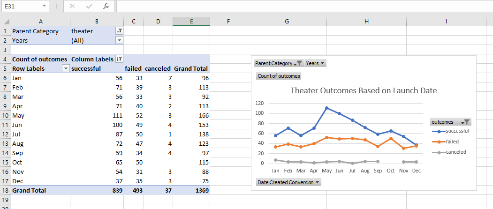
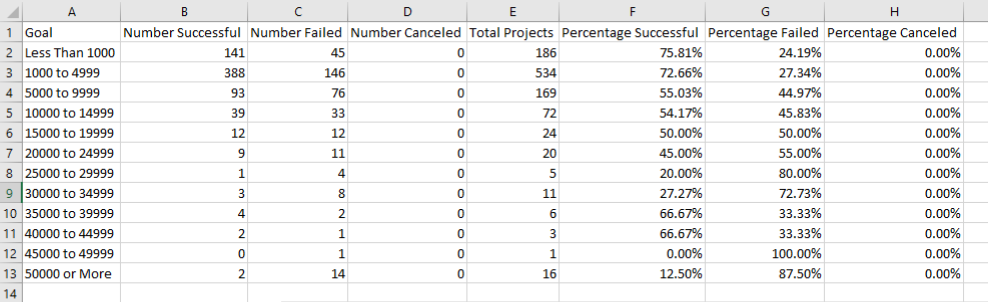
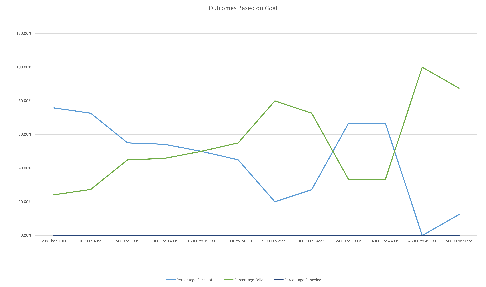

# week1_excel_hw
Week 1 Bootcamp HW
Kickstarting with Excel

# ***"The Data Cometh"***

## Overview of Project

The dataset called "Kickstarter," contains information on over 4,000 crowdfunding projects from around the world. The categories in this dataset range from film and video, food, games, journalism, music, photography, publishing, technology, and theater. Through organizing and analyzing the data, we can determine whether there are specific factors that make a project's campaign successful. For this project, we're most interested in the theater category. My client Louise wants to launch her own play called Fever. 

## Purpose
Not everyone’s dream projects become a reality, especially if you don't have the money in your pocket to financially support it. When that's the case, a project needs to rely on crowdfunding to reach its goal. However, how do you increase the likelihood that outside sources are going to be willing to give you the amount of money that a project needs? In the US alone, thirty-seven percent of crowdfunding projects for plays failed. That’s a sizeable amount! 

By analyzing the dataset Kickstarter, we can find trends between projects that were successful and ones that were a failure. This way we can increase the likelihood of Louise’s dream becoming a reality!

# Analysis and Challenges

## Analysis of Outcomes Based on Goals

The dataset Kickstarter contains over four thousand rows of data and numerous columns, which makes it a sizable sheet to analyze. In order to find the information that I wanted, I applied filters to all the columns. This way I can sort the sheet based on the outcomes of all crowdfunding projects, which country they took place in, and when they were started. Louise wants her play to take place in the US, therefore I need to focus my analysis on only US plays. Once I was able to pinpoint my data to only US plays, I created separate sheets in order to readily have access to the plays that were successful and failed kick starters. 

With the data more filtered now, it was easier to do some descriptive statistics by being able to pull numbers from the Goal column. The Goal column is one of our most important pieces of information because that sets up the overall size and cost of the play. 

I was able to get these numbers by using functions within Excel, which let me pull from the sheets and columns that I wanted by naming them. This way I can gain an understanding of what is a realistic amount of money that Louise can ask for. 

## Analysis of Outcomes Based on Launch Date

Within the Kickstarter dataset, we can also see when all the crowdfunding projects were started and when they ended. Unfortunately, this information is in the form of Unix timestamps. Which is a measurement of the number of seconds since midnight of January 1, 1970. Using a function, I was able to convert these timestamps into proper dates. 

Having these dates is a valuable piece of information because we can potentially find some trends with the outcomes of the projects and their start date. Is there a certain month that produces a higher chance of success? The best way to organize this information is to use pivot tables! With the use of this helpful tool in Excel, we can filter this information and create something that is visually easy to understand. I put “outcome” into the columns value, “Date Created Conversion” into the rows value, and “outcome” into the values box. 

## Challenges and Difficulties Encountered

The biggest challenge I had while organizing all this data was figuring out how to apply filters to numerous columns. If you select one column at a time and click apply filter, you can’t use that button again on another column without deleting your first filter. I knew that if I turned cells within a column into a table, I could apply filters. However, turning that data into a table affected my ability to pull that information from other sheets. Unfortunately, I turned a few columns into tables and reverting them back wasn’t possible because I did it to 4,000 rows. Excel would just crash anytime I tried to revert what I did. So, I had to spend over an hour redoing all my previous work by recreating my Kickstarter sheet. Meanwhile, all I really had to do was control click the columns in order to select the ones that I wanted to apply filters to.

# Results

## What are two conclusions you can draw about the Outcomes based on Launch Date?

The pivot table is useful in showing how many plays failed and succeeded based on the months of the year for when they were launched. You can also see the total volume of how many plays are successful, live, failed, and canceled. The grand total is important because you can use that to calculate the percentage of each of these variables. Just because May has the highest number of failed plays, that doesn’t mean it has the highest chance of failing. December is the month with the highest chance of failing (47%). Meanwhile, May has the highest chance of success (67%). Given the analysis that I can do on this data, I would recommend Louise to start her crowdfunding in May. 

## What can you conclude about the Outcomes based on Goals?

Given the descriptive statistics that we were able to collect, I would recommend that Louise keep her goal below $5,000. However, there are plays that failed even though their goal was below $5,000. If we want to have the highest chance of success, I would reccomend that the goal stays below $1,000.

## What are some limitations of this dataset?

I think a limitation of this dataset is not knowing where in the US these projects are taking place. I believe this would increase the likelihood of Louise’s play being successful if we can calculate that into our analysis. In addition, types of plays should be a factor. Whether a play is a comedy, tragedy, tragicomedy, or melodrama could impact success rates. Investors have preferences and trying to understand what’s more popular should be considered. 

## What are some other possible tables and/or graphs that we could create?

Having a donut graph for each of the months on the Outcomes Based on Launch Date sheet would be a good addition. That way the percentages of success or failure rates can be properly represented. The values on the pivot table are useful, but they don’t tell you the entire story. Donut graphs are visually easier for people to read.

